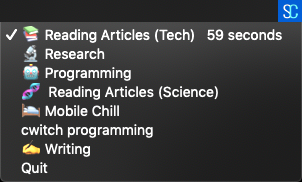

<p align="center">
  
  <p align="center">
      <a href="https://circleci.com/gh/Promignis/cwitch"></a>
      <a href="/LICENSE"></a>

  </p>
</p>

Conscious Swtich (cwitch, pronounced switch)
is a cross platform system tray app that allows you
create some modes via a json file(`data.json`) and
tracks the time you spend between these modes.

Great way to switch between tasks, modes etc consciously and mindfully.

It's aim is to help you reduce unconscious and mindless activities(browser tab switches, social media, youtube etc)

## Cwitch Json file format

```
{
  "modes": [
    {
      "mode": "Reading",
      "emoji": "📚"
    }
  ]
}
```

#### Example output


`--data` flag to specify the path to Cwitch Json file
Node: (optional, if not specificed will look for `data.json` in local folder)

eg: `cwitch --data ./data.main.json`


`--debug` flag for seeing debug logs

eg: `cwitch --debug`
